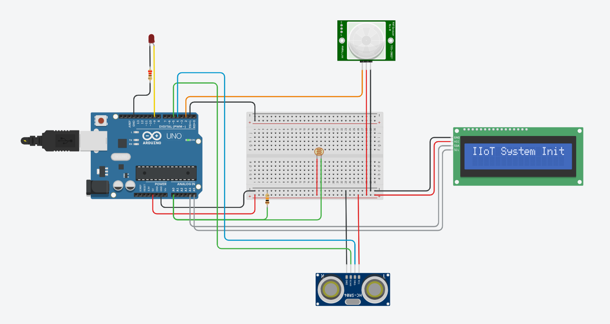
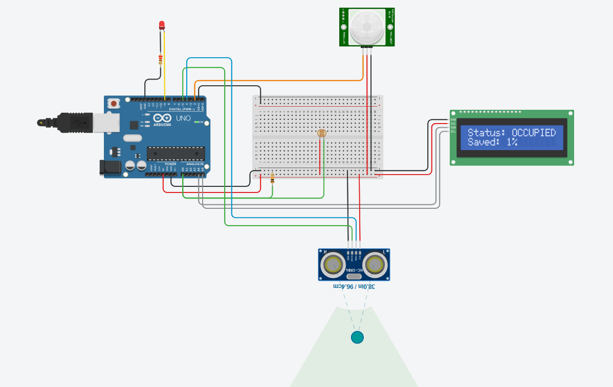

# Adaptive Edge-Computing Smart Lighting System (IIoT)

## 📌 Project Overview
An edge-computing Industrial IoT (IIoT) prototype designed to optimize localized energy consumption. The system dynamically adjusts lighting intensity based on real-time room occupancy and ambient light levels, eliminating the need for cloud-based processing and ensuring zero-latency automated decisions.

**[Link to Live Tinkercad Simulation](https://www.tinkercad.com/things/lk1gU5k12rk-mini-projectadaptive-edge-computing-smart-lighting-iiot)**

## 🚀 Tech Stack
* **Language:** C++ (Arduino IDE)
* **Microcontroller:** Arduino Uno (Edge Node)
* **Sensors:** PIR Motion Sensor, Ultrasonic Proximity Sensor (HC-SR04), Photoresistor (LDR)
* **Actuators/Display:** 16x2 I2C LCD Display, PWM-controlled LED

## ⚙️ Key Features
* **Dual-Presence Detection:** Integrates both PIR and Ultrasonic sensors to accurately detect motion and stationary occupancy, virtually eliminating false-negative shutoffs.
* **Adaptive Daylight Harvesting:** Uses an LDR to measure ambient light, dynamically mapping PWM signals to dim or brighten artificial lighting inversely to natural light.
* **Edge Processing:** All sensor data is processed locally on the Arduino, ensuring rapid response times without reliance on internet connectivity.
* **Energy Optimization Logic:** Features a custom timeout algorithm that gracefully dims the light before complete shutoff when an area is vacated.
* **Real-Time Dashboard:** The local I2C LCD continuously updates the current room status (OCCUPIED/EMPTY) and calculates real-time energy savings percentages based on power draw.

## 📊 System Outputs

**System Initialization & Circuit Design**

**Active System (Occupied State & Distance Tracking)**

## 💻 Code Explanation
The firmware is written in **C++** and utilizes the `Adafruit_LiquidCrystal` library to interface with the I2C display. Here is how the core logic operates:

* **Sensor Polling:** Inside the main `loop()`, the Arduino continuously reads the PIR sensor (`digitalRead`) and calculates proximity using the Ultrasonic sensor (`pulseIn`).
* **PWM Mapping:** Ambient light is read via the LDR (`analogRead`). The `map()` and `constrain()` functions convert this analog reading (50-900) into an inverse PWM value (255-0) to drive the LED smoothly. 
* **Non-Blocking Logic:** To manage the 5-second shutoff timeout without freezing the system, the code uses `millis()` to track the `lastPresenceTime`. This ensures the system remains highly responsive to new motion even while counting down to turn off.
* **Data Visualization:** The system dynamically calculates the percentage of energy saved based on the current PWM target brightness and prints this to the LCD.
